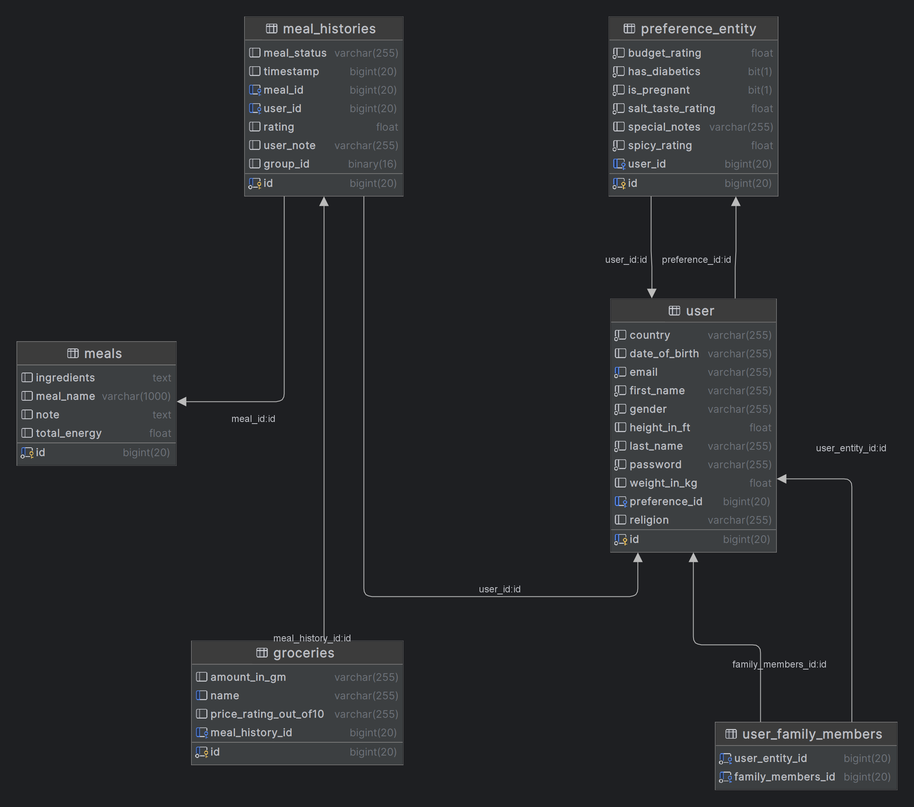

# Ki khabo (কি খাবো) - backend server with springboot

### A system focused on giving intelligent meal suggestion while maintaining proper nutrition and testes.
Try It Now: https://kikhabo-frontend.onrender.com/
- email: test@test.com
- password: 12345678
- -----------------
Api docs: https://kikhabo.onrender.com/swagger-ui/index.html
- -------------------
Kikhabo is an online platform that uses machine learning, weather forecast, season and past few days meal history to predict its user what to eat today and able to give dedicated grocery suggestions in the given price range (estimated).
## Features
- User login and registration.
- Creating meal plan and preference.
- Setting budget for grocery recommendations.
- Getting meal suggestion every day.
- Meal Rating.
- Custom recipe manager.
- Family Manager.
- Energy Consumption Statistics.
- Admin Panel.
- and so more...

## Database Schema

## Tech

Dillinger uses a number of open source projects to work properly:

- [ReactJs] - For frontend development.
- [Java Spring Boot] - Backend server.
- [Docker] - Uses docker to host the backend in render.
- [Machine Learning] - For preparing meal and giving suggestions.
- [Tailwind] - As frontend css solution.
- [Vite] - As resource bundler.